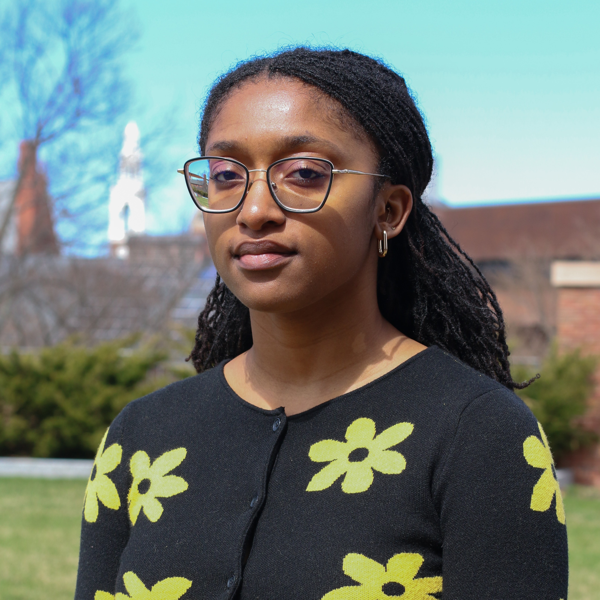

## Photo

## Education

Isabelle got her Master's in Statistics at the University of Vermont in 2025. She previously graduated *cum laude* from UVM with a BS in Mathematical Sciences (Statistics) and minors in Art and Computer Science.

## Interests

- music  
- language (mostly etymology & translation)  
- astrology  
- data representation  
- plants (especially houseplants)  
- mental & physical health
- patterns of any kind

